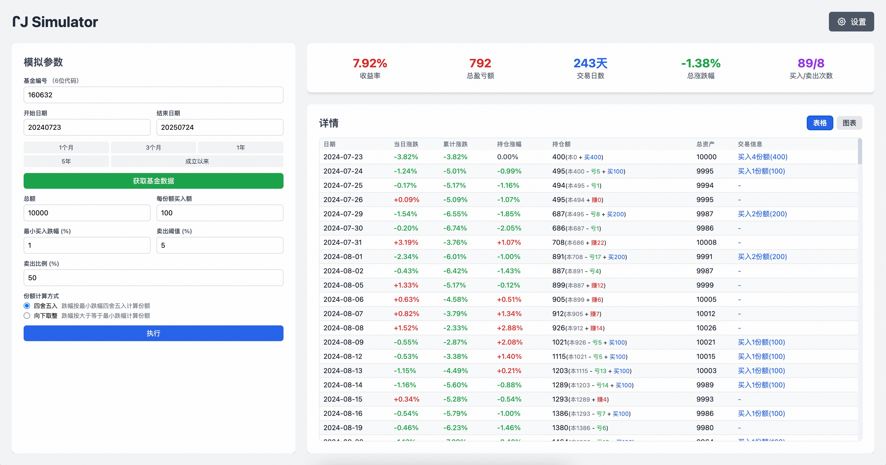
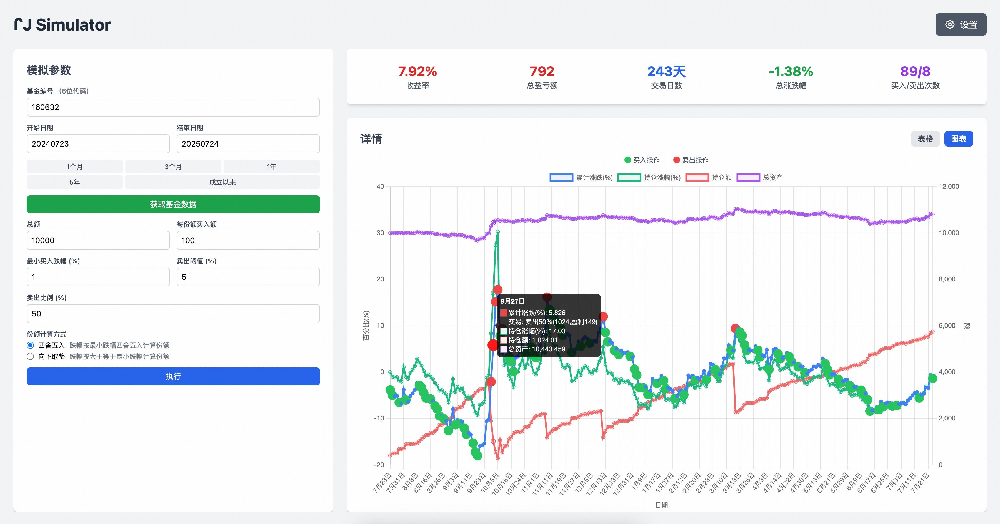

# JJ Simulator - 基金投资策略模拟器

🚀 **在线体验地址：[jj.bstu.cn](http://jj.bstu.cn)**

一个基于 Web 的基金投资策略模拟器，帮助用户模拟和分析定投策略的投资效果。支持自定义投资参数，可视化展示投资收益，是基金投资学习和策略验证的实用工具。

## 📸 功能预览

### 表格数据模式



### 折线图数据模式



## ✨ 主要功能

### 🎯 投资策略模拟

- **智能定投策略**：根据基金跌幅自动买入，涨幅自动卖出
- **参数化配置**：支持自定义总资金、买入金额、跌幅阈值等参数
- **份额计算模式**：支持四舍五入和向下取整两种计算方式
- **动态调仓**：根据盈利情况自动调整仓位

### 📊 数据可视化展示

- **实时收益统计**：总收益率、盈亏金额、交易次数等关键指标
- **双视图模式**：表格详情视图和趋势图表视图
- **交易标记**：图表中清晰标识买入卖出操作点
- **颜色主题**：支持标准和翻转两种颜色模式

### 📈 基金数据管理

- **智能基金搜索**：支持基金代码和名称的模糊匹配搜索，实时下拉提示
- **实时数据获取**：通过 API 获取真实基金历史净值数据
- **灵活时间范围**：支持 1 个月、3 个月、1 年、5 年及成立以来等时间段
- **自动计算**：参数调整后自动重新计算投资结果

### 🔧 用户体验优化

- **响应式设计**：适配桌面和移动端设备
- **实时预览**：参数调整时自动更新计算结果
- **固定表头**：长表格数据浏览体验优化
- **防抖处理**：避免频繁参数调整时的重复计算

## 📖 使用指南

### ⚠️ 重要提醒

- **📈 理想化模拟**：本模拟器未计算基金买卖手续费（申购费、赎回费等），实际投资收益会因手续费而有所降低
- **⏰ 资金时效性**：模拟中假设买卖资金即时到账，但实际基金赎回通常需要 1-7 个工作日到账，影响再投资时机

### 基本操作流程

1. **输入基金代码**

   - 输入 6 位基金代码（如：000001）
   - 选择查询时间范围

2. **获取基金数据**

   - 点击"获取基金数据"按钮
   - 系统自动获取历史净值数据

3. **调整投资参数**

   - 总资金额度
   - 每份额买入金额
   - 最小买入跌幅阈值
   - 卖出盈利阈值和比例

4. **查看模拟结果**
   - 表格模式：查看每日详细交易记录
   - 图表模式：观察收益趋势和交易点位

### 参数说明

| 参数名称     | 说明                     | 示例值 |
| ------------ | ------------------------ | ------ |
| 基金编号     | 6 位基金代码             | 000001 |
| 总资金       | 投资总金额               | 10000  |
| 每份额买入额 | 每次买入的固定金额       | 100    |
| 最小买入跌幅 | 触发买入的最小跌幅百分比 | 1.0%   |
| 卖出阈值     | 触发卖出的盈利百分比     | 5%     |
| 卖出比例     | 卖出时的仓位比例         | 50%    |

### 策略逻辑

**买入逻辑**：

- 当日跌幅 ≥ 最小买入跌幅时触发买入
- 根据跌幅计算买入份额：跌幅 ÷ 最小跌幅 = 买入份额
- 实际买入金额 = 买入份额 × 每份额买入额

**卖出逻辑**：

- 当持仓盈利达到卖出阈值时触发卖出
- 按设定比例卖出部分仓位
- 卖出后剩余资金可用于后续买入

## 🔌 API 接口

### 获取基金列表（新增）

```
GET /api/fund_list?query={搜索关键词}&limit={返回数量}
```

**请求参数**：

- `query`: 搜索关键词，支持基金代码或名称模糊匹配 (可选)
- `limit`: 返回结果数量限制，默认 20，最大 100 (可选)

**响应格式**：

```json
{
  "success": true,
  "data": [
    {
      "code": "000001",
      "name": "华夏成长混合",
      "net_value": 1.0521,
      "daily_growth": -0.85,
      "total_value": 3.214
    }
  ],
  "total_count": 5000,
  "returned_count": 10,
  "cache_time": "2024-01-01 12:00:00"
}
```

### 获取基金数据

```
GET /api/fund_data?code={基金代码}&start_date={开始日期}&end_date={结束日期}
```

**请求参数**：

- `code`: 基金 6 位代码
- `start_date`: 开始日期 (YYYYMMDD 格式)
- `end_date`: 结束日期 (YYYYMMDD 格式)

**响应格式**：

```json
{
  "success": true,
  "data": [
    {
      "date": "2023-01-01",
      "net_value": 1.0521,
      "daily_growth": -0.85
    }
  ]
}
```

## 🛠️ 技术栈

### 前端技术

- **React 18** - 用户界面框架
- **Chart.js** - 数据可视化图表库
- **Tailwind CSS** - 原子化 CSS 框架
- **Babel Standalone** - 浏览器端 JSX 编译

### 后端技术

- **Python Flask** - Web 应用框架
- **Gunicorn** - WSGI HTTP 服务器
- **基金数据 API** - 实时基金净值数据获取

### 部署技术

- **Docker** - 容器化部署
- **Docker Compose** - 多容器编排

## 🚀 快速开始

### 环境要求

- Python 3.8+
- Docker & Docker Compose (可选)

### 本地开发

1. **克隆项目**

```bash
git clone <repository-url>
cd JJ
```

2. **安装后端依赖**

```bash
pip install -r requirements.txt
```

3. **启动后端服务**

```bash
python3 start_api.py
```

后端服务将运行在 `http://localhost:8080`

4. **访问前端页面**

```bash
http://localhost:8080
```

### Docker 部署

1. **使用 Docker Compose 一键部署**

```bash
docker-compose up -d
```

2. **访问应用**

- 前端页面：`http://localhost:8080`
- API 服务：`http://localhost:8080/api`

### 生产环境部署

1. **构建 Docker 镜像**

```bash
docker build -t jj-simulator .
```

2. **运行容器**

```bash
docker run -d -p 80:80 -p 8080:8080 jj-simulator
```

## 📁 项目结构

```
JJ/
├── assets/                 # 资源文件
│   ├── 折线图数据模式.jpg    # 功能截图
│   └── 表格数据模式.jpg      # 功能截图
├── backup/                 # 备份文件
├── index.html             # 前端主页面
├── fund_api.py           # 基金数据API服务
├── start_api.py          # API服务启动脚本
├── test_api.py           # API测试脚本
├── requirements.txt      # Python依赖
├── Dockerfile           # Docker构建文件
├── docker-compose.yml   # Docker编排文件
├── gunicorn.conf.py    # Gunicorn配置
└── README.md           # 项目文档
```

## 🎨 界面特性

- **响应式布局**：适配不同屏幕尺寸
- **固定高度设计**：避免页面滚动，提升使用体验
- **双色主题**：支持标准和翻转颜色模式
- **实时计算**：参数调整后自动重新计算
- **表格固定表头**：大数据量浏览更便捷

## 🤝 贡献指南

欢迎提交 Issue 和 Pull Request 来帮助改进项目！

1. Fork 项目
2. 创建特性分支 (`git checkout -b feature/AmazingFeature`)
3. 提交更改 (`git commit -m 'Add some AmazingFeature'`)
4. 推送到分支 (`git push origin feature/AmazingFeature`)
5. 打开 Pull Request

## 📄 许可证

本项目基于 MIT 许可证开源 - 查看 [LICENSE](LICENSE) 文件了解详情。

## 📞 联系方式

- 项目主页：[jj.bstu.cn](http://jj.bstu.cn)
- 问题反馈：通过 GitHub Issues 提交

---

⭐ 如果这个项目对你有帮助，请给它一个星标！
